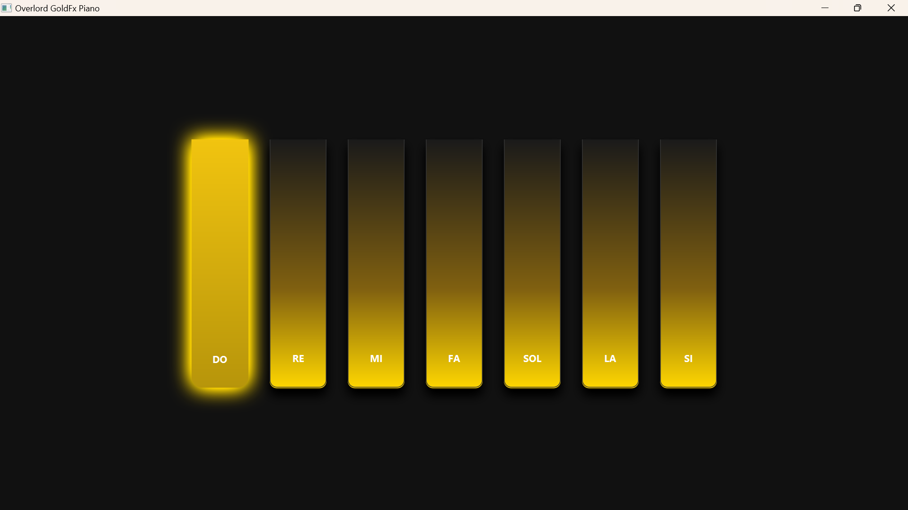

# 🎹 Overlord GoldFx Piano


> Une expérience de piano virtuel haute performance avec un design "Luxe Dark & Gold" et une réactivité audio instantanée.



## ✨ Fonctionnalités

* **Design Ultra-Réaliste :** Utilisation avancée de CSS JavaFX pour simuler des matériaux (Céramique, Or brossé) et la 3D.
* **Réactivité Instantanée :** Moteur audio basé sur `AudioClip` pour une latence zéro.
* **Effets Visuels Dynamiques :**
    * **Glow Effect :** Lueur dorée intense lors de l'activation.
    * **Press Animation :** Simulation physique de l'enfoncement de la touche.
    * **Hover State :** Illumination subtile au survol de la souris.
* **Double Entrée :** Jouable à la souris et au clavier (AZERTY).

## 🎮 Contrôles (Clavier AZERTY)

Le mapping est optimisé pour la rangée centrale du clavier :

| Note | Touche Clavier |
| :---: |:--------------:|
| **DO** |      `1`       |
| **RÉ** |      `2`       |
| **MI** |      `3`       |
| **FA** |      `4`       |
| **SOL** |      `5`       |
| **LA** |      `6`       |
| **SI** |      `7`       |

## 🛠️ Installation et Lancement

### Prérequis
* JDK 25 ou supérieur.
* Maven.

### Étapes
1.  **Cloner le dépôt :**
    ```bash
       git clone https://github.com/Lord-Einstein/tp1_javafx.git
    ```
2.  **Importer dans IntelliJ IDEA :**
    * Ouvrir le projet via le fichier `pom.xml`.
    * Laisser Maven télécharger les dépendances (JavaFX Media, Controls).

3.  **Configurer les sons :**
    * Assurez-vous que vos fichiers `.wav` sont présents dans `src/main/resources/sounds/`.
    * Les fichiers doivent être nommés : `do.wav`, `re.wav`, `mi.wav`, etc.

4.  **Lancer l'application :**
    * Exécuter la classe `PianoApplication.java`.

## 📂 Structure du Projet

```text
src/
├── main/
│   ├── java/
│   │   └── school/coda/overlord/javafx/
│   │       └── PianoApplication.java  <-- Cœur de l'application
│   └── resources/
│       └── sounds/                    <-- Fichiers audio (.wav)
└── pom.xml                            <-- Dépendances Maven
